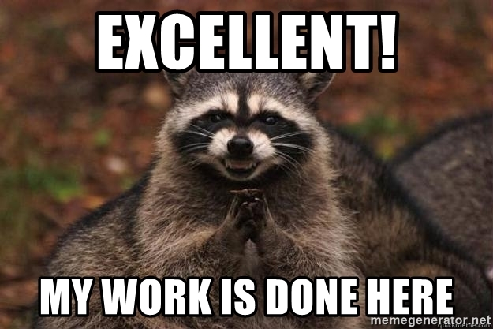

#  Flask

## Flask is a microframework for Python based on Werkzeug, Jinja 2 and good intentions. And before you ask: It's [BSD licensed](http://flask.pocoo.org/docs/license/)!


# Flask is Fun

## And easy to Setup

En realidad lo es, para comprobarlo hagamos lo siguiente:

```bash
pip install Flask
mkdir flask_api
touch hello.py
nano hello.py
```

... y en el archivo _hello.py_ ponemos lo siguiente:

```python
from flask import Flask
app = Flask(__name__)

@app.route("/")
def hello():
    return "Hello World!"
```

... y ahora ejecutamos nuestro pequeño servidor:

```bash
FLASK_APP=hello.py flask run
* Running on http://localhost:5000/
```





.

.

.

.

.

.

.

.

.

.

.

.

.

.

.

# ...no realmente

## Aún hay muchas cosas divertidas que hacer con flask, y dudas que aclarar, como las siguientes.

### ¿Qué es un *micro* framework?

1. "Micro" no significa que toda la app debe estar en un solo archivo, podria, pero no es eso
2. Tampoco que carece de funcionalidades.

### *Solo significa que mantienes la cosas simples, pero ampliables...*

### Como todos sabemos, un gran poder conlleva una gran responsabilidad.

Flask deja en nuestras manos muchas deciciones, como la base de datos, el motos de plantillas, etc, cosas que no deben preocuparnos, al final es muy fácil cambiarlas mas adelante.

Por defecto, Flask no incluye una capa de abstracción para base dedatos, validación de formularios, etc., A cambio, Flask soporta _extenciones o pluggins_ que añaden funcionalidades a nuestras aplicaciones, cual si fueran parte integra de Flask.

Flask puede ser 'pequeño', pero está listo para ir a productivo ;)...

En resumen: **puede ser todo lo que nececitaos y lo que no, tambien...**

## Configuariones y convenciones

Como todo en este mundo, hay algunas cosas que ya vienen predefinidas, en este caso, son cosas muy simples :).

Por convención, plantillas y archivos estáticos son almacenados en subdirectorios del mismo proyecto, usualemnete con los nombres **templates y static**, respectivamente.
Aunque estos pueden ser cambiados a voluntad.

 ## Flask-evolution

El equipo central de revisión de flask revisa constantemente los plugins o módulos, y se aseguran de que estos no causen conflico en futuras liberaciones, por lo qeuna vez que esta corriendo nuestra aplicación, podemos extenderla sin problemas.

Conforme nuestra aplicación crece, las deciones de diseño que tomemos son totalmente nuestras, flask nos seguira proporcionando una base simple sobre la cual ir agregando esas cosas geniales que python nos da.
Adicional a esto, Flas incluye muchas opciones de configuración por lo que si somos unos curiosos o queremos saber mas sobre este tema, siempre podemos revisar la documentación de los siguientes enlaces:

[Becoming Big](http://flask.pocoo.org/docs/1.0/becomingbig/#becomingbig)
[Desing Decisions In Flask](http://flask.pocoo.org/docs/1.0/design/#design)


# Instalación

### Se recomiendan las últimas versiones de Python 3.

### Actualmente soporta _Python 3.4_ y superiores, _Pthon 2.7_ y PyPy.

## Crear un entorno virtual

Lo primero que debemos hacer es crear nuestro entorno virtual, entre otras cosas esto nos permite tener aisladas nuestras dependencias, de esta forma se evitan conflictos con librerias o paquetes del sistema o que usamos en algun otro proyecto.

Antes de comenzar a crearlo, debemos instalar el pqeute, si usamos linux en las principales distros podemos usar los siguientes comandos:

```bash
# Debian o Ubuntu
$ sudo apt-get install python-virtualenv virtualenv

# Fedora
$ sudo dnf install python2-virtualenv python3-virtualenv

# CentOS
$ sudo yum install python-virtualenv python34-virtualenv

# Archlinux
$ sudo pacman -S python2-virtualenv python-virtualenv
```

y ahora si, podemos crear nuestro _entorno-virtual_

```bash
mkdir myproject
cd myproject
virtualenv env --python=python3
```

para esto obviamente debe estar instalado _Python3_.	

Para activarlo solo hacemos lo siguiente:

```bash
cd env
source bin/activate
(env)$
```

en este punto podemos comenzar a trabajar sin preocupaciones de romper algo.
P.D: para desactivar el entorno solo escribimos en la terminal:

```bash
(env)$ deactivate
$
```

lo cual nos regresa al entorno global del sistema.

Como todo, nosotros tenemos la última palabra, así que crear o no un entorno virtual es libre.

# Una simple API.

Para no entrar en grandes detalles, Flask nos permite hacer las cosas como queramos, esto es, tanto podemos realizar un proyecto basado en **MVC** haciendo uso de plantillas y todo lo que usa MVC, tambien podemos realizar una API RestFull

Para comenzar intalemos un paquete:

```bash
(env)$ pip install flask-restful 
```

listo, ahora podemos comenzar a picar código.

